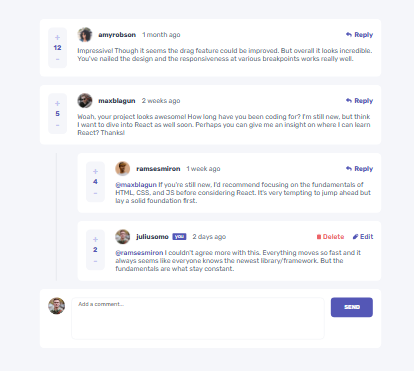

# Frontend Mentor - Interactive comments section solution

This is a solution to the [Interactive comments section challenge on Frontend Mentor](https://www.frontendmentor.io/challenges/interactive-comments-section-iG1RugEG9). Frontend Mentor challenges help you improve your coding skills by building realistic projects. 

## Table of contents

- [Overview](#overview)
  - [The challenge](#the-challenge)
  - [Screenshot](#screenshot)
  - [Links](#links)
- [My process](#my-process)
  - [Built with](#built-with)
- [Author](#author)

## Overview

### The challenge

Users should be able to:

- View the optimal layout for the app depending on their device's screen size
- See hover states for all interactive elements on the page
- Create, Read, Update, and Delete comments and replies
- Upvote and downvote comments

### Screenshot

### Links

- Solution URL: [here](https://www.frontendmentor.io/solutions/interactive-comments-section-with-mern-stack-J3U6UBBjjZ)
- Live Site URL: [here](https://interactive-comments-section-with-m-khaki.vercel.app/)

## My process

### Built with

- Semantic HTML5 markup
- CSS custom properties
- Flexbox
- MongoDB
- NodeJS
- ExpressJS
- [React](https://reactjs.org/) - JS library

## Author

- Frontend Mentor - [@savchrisostomidhs](https://www.frontendmentor.io/profile/savchrisostomidhs)
